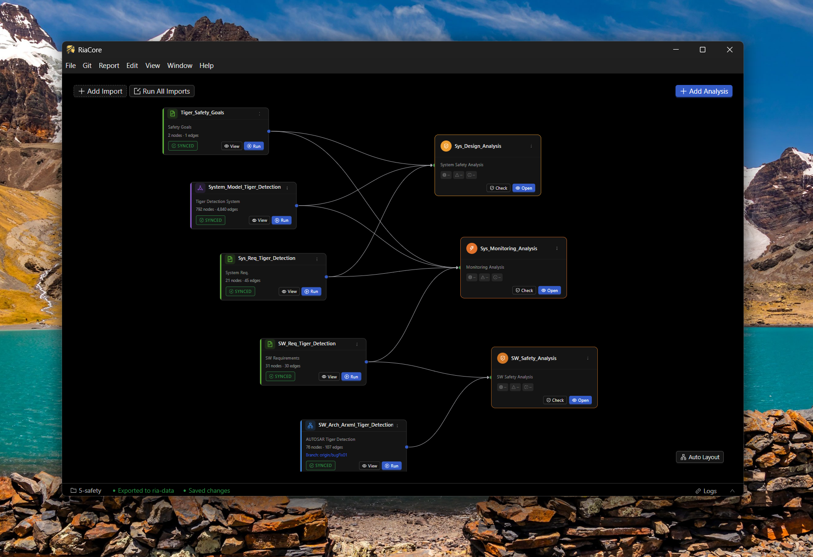

# RiaCore - Reference Project

RiaCore Demo Project

This is the demo project for RiaCore ([github.com/cntSafety/RiaCore](https://github.com/cntSafety/RiaCore)).

SW requirements trace to system requirements through their RST `satisfies`
attributes. ARXML `DESC` notes identify SW requirement allocations to elements
and interfaces.

SOTIF Case C1 identifies insufficient sensing diversity in the original RGB-plus-lidar
configuration. Runtime measure `SOTIF_RT_001` adds thermal sensing and evaluation;
it is included in the current architecture and its status is `Done`.
System requirements `TDS_SEN_003` and
`TDS_SEN_007` reference it through `originating_task`; `SWREQ_SEN_007` satisfies
`TDS_SEN_007` and is allocated to InfraredAcquisition, Fusion and TigerDetectionApp.
Case C2 assesses the low-thermal-contrast limitation of the measure introduced
for Case C1. Validation and residual-risk acceptance remain open.

## Getting started

1. Install RiaCore following the instructions in its repository.
2. Add the importers to load this project's data (start screen --> Add Import button)
3. Do the safety analysis (Add Analysis button)

Alternatively, the ready-made ria project in the `5-safety` folder can be opened with RiaCore directly (File --> Open Workspace --> \ref-project\5-safety).
